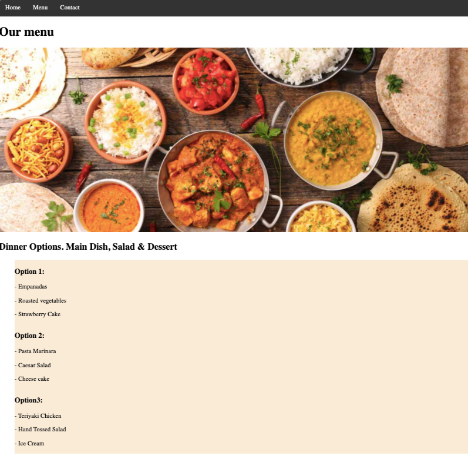

# Restaurant JS

> Project aimed to create different pages connected each through a navbar button, wrapped each of these pages' content within a function exported to a single file (index.js) where all the logic is coded. The project is a second attempt to code using JS as front-end language. Aspect of the pages was incosenquential to the author's goal.

Additional description about the project and its features.

## Live Demo

[live demo](http://germanaquila.me/restaurantJS/)

## Built With

- Javascript
- NPM

## Getting Started

Open your terminal and cd where you want to store the project
Run the following command - git clone https://github.com/realisticattorney/restaurantJS.git
Cd into the directory - cd Library
Open the live server on your VScode Alt + L then Alt + o
To get a local copy up and running follow these simple example steps.

## Author

👤 **German Aquila**

- GitHub: [@realisticattorney](https://github.com/realisticattorney)
- Twitter: [@ContoliAxl](https://www.twitter.com/contoliaxl)
- Linkedin: [@germanaquila](https://www.linkedin.com/in/german-aquila-55a9171b5/)

## 🤝 Contributing

Contributions, issues, and feature requests are welcome!

Feel free to check the [issues page](../../issues/).

## Show your support

Give a ⭐️ if you like this project!

## Acknowledgments

- Hat tip to anyone whose code was used
- Inspiration
- etc

## 📝 License

This project is [MIT](./MIT.md) licensed.